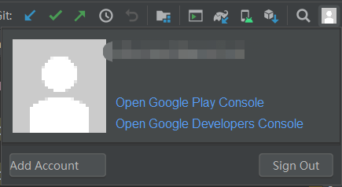
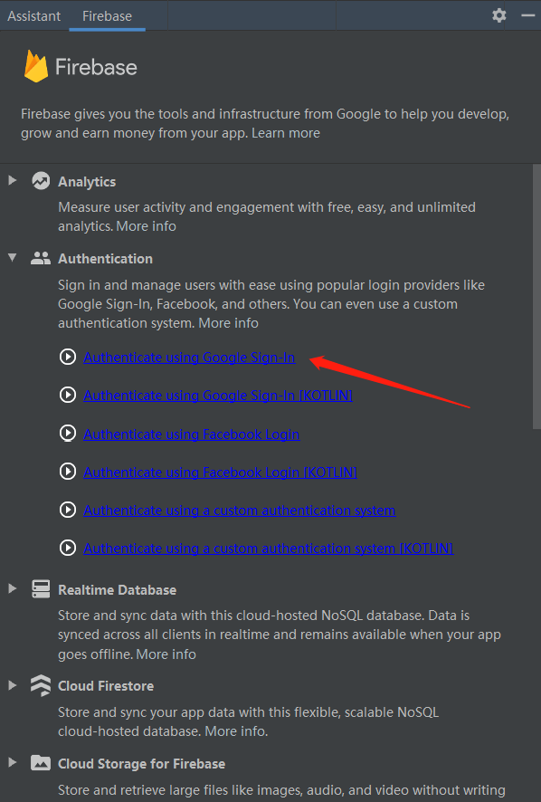
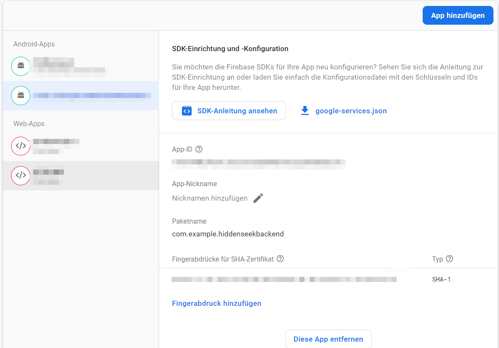

### An application for Administrator to add special seed

#### How to use it

1. Please use google account provided from our team (if you don't have, please send us a e-mail), sign in on android studio with the this account  

2. Then open android studio, click Firebase on the ToolBar under Tools, as showing in picture as follow  

3. Then do as following picture showing to activate Authentication using Google Sign-in function  

4. Open Firebase Console you will see your app is now binded with your account  
5. Open your projectsetting, add your own SHA-1 fingerprint to firebase by using ./gradlew signingReport on your android directory  
.
If you still have problem, then please use the following link: https://developers.google.com/android/guides/client-auth?authuser=3
6. Install the app on your phone. Sign in with your own google account or create a local account by the other variante. 
