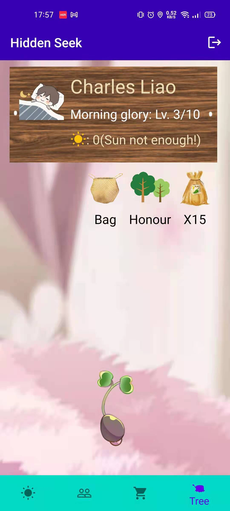
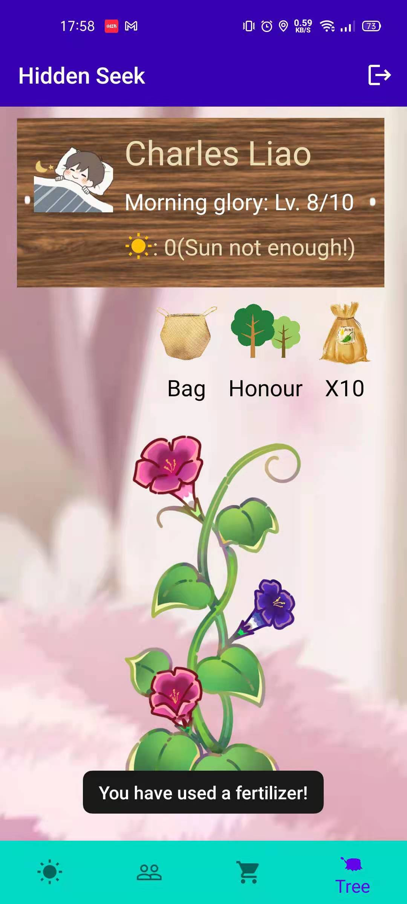

This is a geolocation-based Android client similar to Pokemon Go game. The details are showed in the document User Manual.pdf. 

## Goal

We made an interesting geolocation Android game.  The idea of the game we designed is about the following. Out of the purpose of encouraging players to go outside and do exercise, the whole game is based on a map, and people need to go out and walk to get the items that are set on the map. We set up special seeds and bombs as features, which allows players to meet more people by burying, picking up bombs and sharing information about special seeds with your friends through messages. Items in the shop and reward on the map are set up as flowers and trees, allowing players to learn more about plants. We have set a daily mission where the user needs to reach the location marked by the task to get the reward, which helps the user to leave home at least once every day. In addition, the buddy system also promotes users communication, players will not be alone in the game. To motivate players to keep playing, we set coins as rewards and a record of every plant the player harvests. The player who sees these record could feel a sense of accomplishment.

## Video

> **Youtube:** https://www.youtube.com/watch?v=d61LR1MTj-o
>
> **bilibili:** https://www.bilibili.com/video/BV1if4y1j7gM/

If you find it interesting, please don't hesitate to share and subscribe this video. Feel free to contact us if you have any thoughts.

## Overview of this game

<table>
<td></td> 
<td></td> 
<td></td> </tr>
<td></td> 
<td></td> 
<td></td> </tr>
<td></td> 
<td></td> 
<td></td> </tr>
</table>

